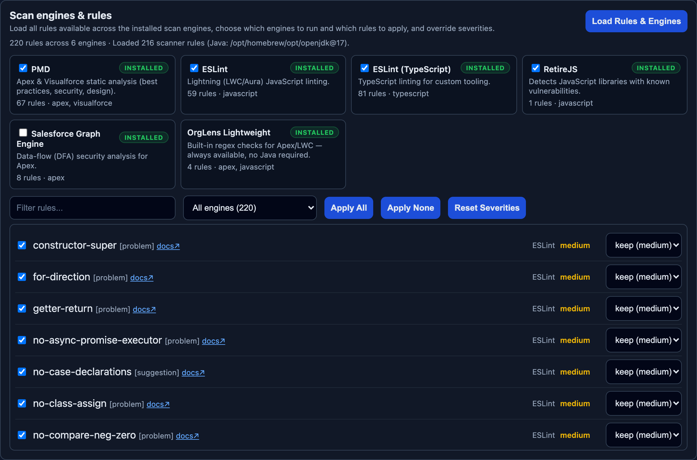
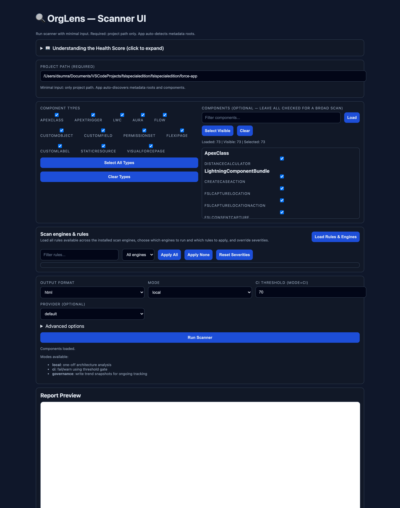
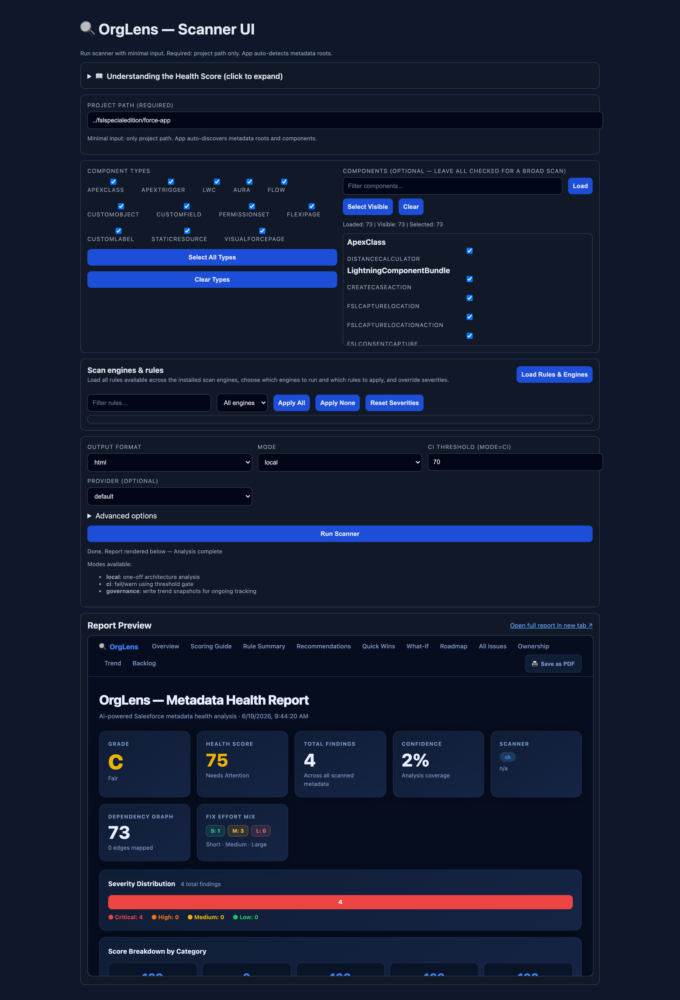

# 🔍 OrgLens

> **Salesforce Metadata Health & Tech-Debt Intelligence.**
> An AI-assisted Salesforce metadata health analyzer. Point it at a Salesforce
> project and get a **Health Score**, a prioritized list of technical-debt
> issues with **deep links to the exact rule documentation**, dependency
> impact, remediation playbooks, and a Jira-ready backlog — in an interactive
> HTML report or as JSON/Markdown for CI.

> **See it in action:** a real sample run lives in [`examples/`](./examples/) —
> view the [rendered HTML report](https://raw.githack.com/deesum/orglens/main/examples/sample-report.html).



---

## Table of Contents

1. [Who is this for?](#1-who-is-this-for)
2. [What value does it provide?](#2-what-value-does-it-provide)
3. [Feature overview](#3-feature-overview)
4. [Prerequisites (and how to install each)](#4-prerequisites-and-how-to-install-each)
5. [Install OrgLens](#5-install-orglens)
6. [Quick start (first run in 2 minutes)](#6-quick-start-first-run-in-2-minutes)
7. [Using the Browser UI](#7-using-the-browser-ui)
8. [Using the CLI](#8-using-the-cli)
9. [Understanding the report](#9-understanding-the-report)
10. [Run modes (local / CI / governance)](#10-run-modes-local--ci--governance)
11. [AI recommendations (optional)](#11-ai-recommendations-optional)
12. [Troubleshooting](#12-troubleshooting)
13. [Command reference](#13-command-reference)

---

## 1. Who is this for?

| Persona                                    | How they use OrgLens                                                                                                                       |
| ------------------------------------------ | ------------------------------------------------------------------------------------------------------------------------------------------ |
| **Technical Architect**                    | Rapid health assessment of an unfamiliar or inherited org, identify hotspots, justify refactoring with evidence, set governance baselines. |
| **System Integrator (SI) / Delivery Lead** | Generate a prioritized remediation backlog, export to Jira, assign by team/release train, track trend across sprints.                      |
| **Salesforce Developers**                  | See exactly which rule failed, where, why it matters, how to fix it, with a one-click link to the official rule documentation.             |
| **Delivery / Engineering Managers**        | Track a single Health Score over time, gate pull requests on quality thresholds, report progress to stakeholders.                          |
| **QA / Release Engineers**                 | Wire OrgLens into CI to fail or warn when code quality regresses.                                                                          |

## 2. What value does it provide?

- **Cut "archaeology" time.** Architects normally spend hours digging through
  metadata to understand debt. OrgLens produces a structured assessment in seconds.
- **Prioritization, not just a wall of findings.** Every issue is ranked by
  severity × blast radius × effort so teams fix the things that matter first.
- **Actionable, evidence-linked guidance.** Each finding shows _what, where,
  why, and how to fix_ — plus a deep link to the exact rule documentation.
- **Quick Wins.** Automatically surfaces high-severity / low-effort items for
  the best return on investment.
- **Governance over time.** Snapshots + trend deltas show whether quality is
  improving or regressing across releases.
- **Plug into delivery.** Jira-ready CSV backlog with owner team and release
  train tags; CI gate for pull requests.

## 3. Feature overview

**Analysis engine**

- Salesforce Code Analyzer (PMD + ESLint) integration
- Built-in **lightweight fallback scanner** (works even without Java — see note)
- Apex, LWC, Flow, Aura, Custom Objects/Fields, Permission Sets, Flexipages,
  Custom Labels, Static Resources, Visualforce discovery
- Dependency graph + **blast-radius** impact scoring
- Weighted **Health Score** with category breakdown (security,
  maintainability, reliability, performance, operability)
- Confidence metric for analysis coverage
- **Automatic Java detection** — finds an installed JDK (Homebrew, system, SDKMAN)
  so the full Salesforce Code Analyzer runs even when macOS's `/usr/bin/java`
  stub would otherwise block it; falls back to the lightweight scanner only when
  no JDK exists
- **Engine awareness** — see every scan engine (PMD, ESLint, ESLint-TypeScript,
  RetireJS, Salesforce Graph Engine, plus the built-in lightweight engine), its
  install status, and how to install/enable it; choose which engines to run
- **Rule management** — list every available rule across all engines
  (`orglens rules` — 200+ rules), then disable rules or override their severity
  from the UI, CLI flags, or config (`ruleOverrides.disabled` /
  `ruleOverrides.severity`)
- **Scoring Guide** built into the HTML report and UI explaining what the
  Health Score, letter grade, severities, confidence, and priority mean

**Architect intelligence**

- **Letter grade (A–F)** alongside the numeric Health Score
- **What-If Simulator** — projected score lift if you fix a given rule,
  component, or severity group ("fix X → score becomes Y")
- **Remediation Roadmap** — prioritized debt packed into effort-weighted
  sprints with the projected score after each sprint
- **Ownership** view — findings grouped by owning team via configurable
  path-glob rules (`ownership.rules`)
- **Score history sparkline** built from governance snapshots

**Interactive HTML report**

- Colour-coded KPI dashboard and **severity distribution** bar
- **Rule Summary** with deep links to each rule's official documentation
- AI/heuristic **Recommendations** cards
- **Quick Wins** (high impact, low effort)
- **All Issues** table: severity badges, component column, compact paths, and
  per-row rule documentation links
- **Filtering**: by search, severity, effort, metadata type, and
  click-to-filter component hotspot chips — combine all of them with
  dismissable filter tags
- **Sortable** columns + **CSV export** of the filtered view
- **Domain Playbooks** (Apex / LWC / Flow remediation steps)
- **Save as PDF** button (print-optimized, ink-friendly stylesheet)

**Delivery integrations**

- JSON / Markdown / HTML output
- Jira-ready CSV backlog export (`--backlog-out`, includes owner column)
- **Create Jira issues** directly via REST API (`--create-jira`, dry run by default)
- **PR comment bot** via Markdown summary (`--summary-out`) + GitHub Action
- **Diff mode** — compare two reports to see introduced vs resolved findings
- **Ask mode** — natural-language Q&A over a report using your LLM key
- CI gate with configurable threshold
- Governance snapshots for trend tracking
- Local Browser UI for point-and-click scans

> **Note on coverage:** The full PMD + ESLint rule set requires Java + the
> Salesforce Code Analyzer plugin. If Java is unavailable, OrgLens automatically
> falls back to a lightweight regex scanner so you still get actionable output
> (with reduced coverage). Install Java for complete results.

---

## 4. Prerequisites (and how to install each)

| #   | Prerequisite               | Required?               | Purpose                           |
| --- | -------------------------- | ----------------------- | --------------------------------- |
| 1   | **Node.js 20+**            | ✅ Required             | Runs the OrgLens CLI/UI           |
| 2   | **Git**                    | ✅ Required             | Clone the repo                    |
| 3   | **Java (JDK 17)**          | ⭐ Strongly recommended | Enables full PMD/ESLint scanning  |
| 4   | **Salesforce CLI (`sf`)**  | ⭐ Recommended          | Provides the Code Analyzer plugin |
| 5   | **Code Analyzer plugin**   | ⭐ Recommended          | The full rule engine              |
| 6   | **OpenAI / Anthropic key** | ◻ Optional              | AI-written recommendations        |

### 4.1 Node.js 20+

**macOS (Homebrew):**

```bash
brew install node
```

**Windows:** download the LTS installer from [nodejs.org](https://nodejs.org/), or:

```powershell
winget install OpenJS.NodeJS.LTS
```

**Linux / cross-platform (nvm):**

```bash
curl -o- https://raw.githubusercontent.com/nvm-sh/nvm/v0.40.1/install.sh | bash
nvm install 20 && nvm use 20
```

Verify:

```bash
node -v   # expect v20.x or higher
```

### 4.2 Git

**macOS:** `brew install git` (or `xcode-select --install`)
**Windows:** `winget install Git.Git`
**Linux:** `sudo apt install git` / `sudo dnf install git`

```bash
git --version
```

### 4.3 Java (JDK 17) — for full scanning

PMD and the Salesforce Graph Engine need a JDK 11+. **You don't have to configure
`JAVA_HOME` or `PATH`** — OrgLens automatically detects JDKs installed via
Homebrew, the system (`/Library/Java/JavaVirtualMachines`, `/usr/lib/jvm`), or
SDKMAN, and works around the macOS `/usr/bin/java` stub that otherwise blocks the
scanner. Just install a JDK:

**macOS (Homebrew):**

```bash
brew install openjdk@17
```

**Windows:** `winget install EclipseAdoptium.Temurin.17.JDK`
**Linux:** `sudo apt install openjdk-17-jdk`

That's all. To confirm what OrgLens detected, run `orglens rules` — the footer
prints the JDK path it's using (or tells you none was found). If no JDK is
present, OrgLens still runs its built-in lightweight scanner.

### 4.4 Salesforce CLI

```bash
npm install -g @salesforce/cli
sf --version
```

### 4.5 Salesforce Code Analyzer plugin

```bash
sf plugins install @salesforce/sfdx-scanner
sf plugins        # confirm sfdx-scanner is listed
```

### 4.6 (Optional) AI provider key

Set whichever you have:

```bash
export OPENAI_API_KEY="sk-..."
# or
export ANTHROPIC_API_KEY="sk-ant-..."
```

---

## 5. Install OrgLens

```bash
# 1. Clone
git clone https://github.com/deesum/orglens.git
cd orglens

# 2. Install dependencies
npm install

# 3. Build
npm run build

# 4. Make the `orglens` command available globally
npm link
```

Verify the install:

```bash
orglens --version
orglens --help
```

---

## 6. Quick start (first run in 2 minutes)

Point OrgLens at any Salesforce project folder. It auto-detects metadata roots
(`force-app/main/default`, `apps/*/force-app/main/default`, etc.) — you do
**not** need to point at the exact metadata folder.

```bash
orglens analyze --repo "/path/to/your/salesforce-project" --format html
```

This writes `orglens-report.html` (and `orglens-backlog.csv`) into the project folder.
Open the HTML file in any browser:

```bash
open orglens-report.html        # macOS
# or just double-click it
```

That's it. The minimum required input is `--repo`.

---

## 7. Using the Browser UI

Prefer point-and-click? Launch the local UI:

```bash
orglens ui --repo "/path/to/your/salesforce-project" --port 4173
```

Open **http://127.0.0.1:4173**.



From here you can:

- Enter / confirm the project path (only required field)
- Read the built-in **Scoring Guide** explainer (Health Score, grade, severities)
- Pick component **types** (Apex, LWC, Flow, and more) — selecting a type
  auto-selects its components — and optionally narrow to specific **component
  names** (checkboxes show exactly what's selected)
- **Load Rules & Engines** to see every scan engine and all available rules
- Choose output format, run **mode**, CI threshold, and AI provider
- Set `package.xml`, target org, team, release train, and backlog path under
  **Advanced options**
- Click **Run Scanner** and preview the report inline (or open it in a new tab)



### Scan engines & rules panel

Click **Load Rules & Engines** to populate the catalog:


- Each **engine card** shows its status — `Installed`, `Needs Java`, or
  `Not installed` — with install directions when it's unavailable, and a
  checkbox to include/exclude that engine from the run (Salesforce Graph Engine
  is off by default since it's heavier)
- The **rules table** lists every available rule across engines with its engine,
  default severity, and a docs link. Use the search box and **engine filter** to
  narrow the list
- Untick a rule's checkbox to **disable** it, or use the dropdown to **override
  its severity**; **Apply All / Apply None / Reset Severities** act in bulk
- Your selections are applied on the next **Run Scanner**

> Tip: if the UI looks stale after an update, the old server is probably still
> running. Stop it (`pkill -f "dist/cli.js ui"`), rebuild (`npm run build`),
> restart, and hard refresh the browser (`Cmd/Ctrl+Shift+R`).

---

## 8. Using the CLI

**Basic:**

```bash
orglens analyze --repo . --format html
```

**Scope to specific component types/names:**

```bash
orglens analyze --repo . --format html \
  --component-types ApexClass,Flow \
  --components DistanceCalculator,FSL_Capture_WOLI_Location
```

**Jira-ready backlog with ownership tags:**

```bash
orglens analyze --repo . --format html \
  --team "FSL-Architecture" --release-train "R2" \
  --backlog-out "./orglens-backlog.csv"
```

**JSON for downstream tooling:**

```bash
orglens analyze --repo . --format json --out ./orglens-report.json
```

---

## 9. Understanding the report

The HTML report is organized top-to-bottom for an architect's workflow:

1. **Overview** — Health Score, total findings, confidence, scanner status,
   dependency graph size, effort mix, severity distribution, score breakdown by
   category, and most-affected component chips.
2. **Rule Summary** — every rule that fired, its count, max severity, example
   files, and a **"View docs ↗"** link to the exact rule reference.
3. **Recommendations** — AI or heuristic remediation suggestions linked to
   evidence findings.
4. **Quick Wins** — high-severity, low-effort issues to tackle first.
5. **All Issues** — the full prioritized table. Each row's rule name links to
   its specific documentation. Filter by search/severity/effort/type/component
   and export the filtered set to CSV.
6. **Playbooks** — domain-specific fix + verification steps.
7. **Trend Delta** — score and finding changes vs the last snapshot.
8. **Backlog** — count of Jira-importable items.

**Health Score bands:** `85+` Healthy · `70–84` Needs Attention · `<70` At Risk.

---

## 10. Run modes (local / CI / governance)

**Local (default)** — one-off architecture assessment:

```bash
orglens analyze --repo . --format html --mode local
```

**CI gate** — fail/warn when score drops below a threshold (great for PRs):

```bash
orglens analyze --repo . --format json --mode ci --threshold 70
# exit code is non-zero when the gate fails
```

**Governance** — persist snapshots so trend deltas accumulate over time:

```bash
orglens analyze --repo . --format md --mode governance
```

---

## 11. AI recommendations (optional)

Without an API key, OrgLens generates solid heuristic recommendations. With a key,
it produces richer, evidence-linked guidance:

```bash
export OPENAI_API_KEY="sk-..."      # or ANTHROPIC_API_KEY
orglens analyze --repo . --format html --provider openai
```

Recommendations are always tied to specific finding IDs to keep them grounded
(no hallucinated advice).

---

## 12. Troubleshooting

| Symptom                                                      | Cause                                                              | Fix                                                                                                                          |
| ------------------------------------------------------------ | ----------------------------------------------------------------- | -------------------------------------------------------------------------------------------------------------------------- |
| "Used lightweight fallback checks" / few findings            | No JDK found, so PMD/Graph Engine couldn't run                     | Install a JDK 11+ (`brew install openjdk@17`). OrgLens auto-detects it — no `JAVA_HOME`/`PATH` setup needed                  |
| "Unable to locate a Java Runtime" despite Java installed     | macOS `/usr/bin/java` stub shadows the real JDK                    | Fixed automatically — OrgLens probes Homebrew/system/SDKMAN JDKs and injects `JAVA_HOME` for the scanner                    |
| An engine shows "Not installed"                              | Salesforce Code Analyzer plugin missing                           | `sf plugins install @salesforce/sfdx-scanner` (the engines panel shows the exact command)                                  |
| `orglens: command not found`                                 | `npm link` not run / shell not reloaded                           | Re-run `npm run build && npm link`, open a new terminal                                                                     |
| UI shows an old version                                      | A stale `orglens ui` server is still running the old build        | `pkill -f "dist/cli.js ui"`, then `npm run build`, restart the server, hard refresh (`Cmd/Ctrl+Shift+R`)                    |
| No components found                                          | Wrong project path                                                | Pass the project root; OrgLens auto-detects `force-app/main/default` underneath                                            |
| Recommendations empty                                        | No API key                                                        | Set `OPENAI_API_KEY` or `ANTHROPIC_API_KEY` (optional)                                                                      |

---

## 13. Command reference

### `orglens analyze`

| Option                           | Default                | Description                                                           |
| -------------------------------- | ---------------------- | --------------------------------------------------------------------- |
| `--repo <path>`                  | _(required)_           | Project root (metadata roots auto-detected)                           |
| `--package <path>`               | —                      | `package.xml` to narrow scan scope                                    |
| `--target-org <alias>`           | —                      | Salesforce org alias (reserved for retrieve flows)                    |
| `--format <json\|md\|html>`      | `html`                 | Output format                                                         |
| `--out <path>`                   | `orglens-report.<fmt>` | Report output path                                                    |
| `--mode <local\|ci\|governance>` | `local`                | Run mode                                                              |
| `--config <path>`                | —                      | Agent config YAML                                                     |
| `--provider <openai\|anthropic>` | —                      | LLM provider for recommendations                                      |
| `--threshold <number>`           | —                      | CI fail threshold (mode=ci)                                           |
| `--team <name>`                  | `Architecture`         | Owner team for backlog export                                         |
| `--release-train <name>`         | `R1`                   | Release train for backlog export                                      |
| `--backlog-out <path>`           | `orglens-backlog.csv`  | Jira-ready CSV output path                                            |
| `--component-types <list>`       | —                      | Comma-separated types to include                                      |
| `--components <list>`            | —                      | Comma-separated component names to include                            |
| `--summary-out <path>`           | —                      | Write a compact Markdown summary (for PR comments)                    |
| `--create-jira`                  | off                    | Create Jira issues from the backlog (dry run unless `--jira-execute`) |
| `--jira-execute`                 | off                    | Actually create Jira issues (requires `JIRA_*` env vars)              |
| `--disable-rules <list>`         | —                      | Comma-separated rule names to exclude from results                    |
| `--severity-overrides <pairs>`   | —                      | Comma-separated `RuleName=severity` pairs (e.g. `ApexDoc=low`)        |
| `--engines <list>`               | scanner defaults       | Comma-separated engines to run (e.g. `pmd,eslint`)                    |

### `orglens rules`

List every scan engine and **all** the rules they provide (200+ across PMD,
ESLint, ESLint-TypeScript, RetireJS, Salesforce Graph Engine, and the built-in
lightweight engine), each with its default severity and category. Engines that
aren't installed — or that need Java — are flagged with install directions. Use
this to decide what to disable or re-prioritize, then feed those choices back
via `--disable-rules` / `--severity-overrides` / `--engines`, the config file
(`ruleOverrides`), or the **Rules panel** in the browser UI.

| Option     | Default | Description                     |
| ---------- | ------- | ------------------------------- |
| `--json`   | off     | Output the catalog as JSON      |

```bash
orglens rules
orglens analyze --repo ./force-app \
  --engines pmd,eslint \
  --disable-rules ApexDoc,TodoComment \
  --severity-overrides ApexCRUDViolation=critical
```

> **Java:** PMD and Salesforce Graph Engine need a JDK 11+. OrgLens auto-detects
> Homebrew (`/opt/homebrew/opt/openjdk@17`), system JVMs, and SDKMAN installs —
> no `JAVA_HOME` or `PATH` setup required. If no JDK is found, install one with
> `brew install openjdk@17` (macOS) or from [Adoptium](https://adoptium.net),
> and OrgLens picks it up automatically.

### `orglens diff`

Compare two JSON reports to see what changed between runs.

| Option              | Default      | Description                       |
| ------------------- | ------------ | --------------------------------- |
| `--baseline <path>` | _(required)_ | Baseline report JSON              |
| `--current <path>`  | _(required)_ | Current report JSON               |
| `--out <path>`      | —            | Write the Markdown diff to a file |

```bash
orglens diff --baseline before.json --current after.json --out diff.md
```

### `orglens ask`

Ask a natural-language question about a generated JSON report (requires an LLM key).

| Option                           | Default               | Description                         |
| -------------------------------- | --------------------- | ----------------------------------- |
| `<question>`                     | _(required)_          | Your question (positional argument) |
| `--report <path>`                | `orglens-report.json` | Path to the JSON report             |
| `--config <path>`                | —                     | Agent config YAML                   |
| `--provider <openai\|anthropic>` | —                     | LLM provider                        |

```bash
orglens ask "Which components carry the most critical debt and why?"
```

### Jira issue creation

Set these env vars, then run `orglens analyze --create-jira --jira-execute`:

```bash
export JIRA_BASE_URL="https://your-domain.atlassian.net"
export JIRA_EMAIL="you@example.com"
export JIRA_API_TOKEN="<api-token>"
export JIRA_PROJECT_KEY="ORG"
export JIRA_ISSUE_TYPE="Task"   # optional, defaults to Task
```

Without `--jira-execute` the command performs a safe dry run and prints what it would create.

### Ownership & roadmap config

Add an `ownership` and `roadmap` block to `agent.config.yml` (see
`agent.config.example.yml`) to route findings to teams and tune sprint capacity.

### `orglens ui`

| Option                 | Default     | Description                   |
| ---------------------- | ----------- | ----------------------------- |
| `--repo <path>`        | current dir | Project root                  |
| `--package <path>`     | —           | `package.xml` to narrow scope |
| `--target-org <alias>` | —           | Salesforce org alias          |
| `--port <number>`      | `4173`      | UI server port                |

---

## License

Released under the [MIT License](./LICENSE) © 2026 Deepak Sumra.

## Project documentation

- `docs/quickstart.md` — condensed quick start
- `docs/config-reverse-engineer-agent/architecture.md` — architecture
- `docs/config-reverse-engineer-agent/github-setup.md` — GitHub setup
- `docs/config-reverse-engineer-agent/agent-operating-instructions.md` — agent operating model
